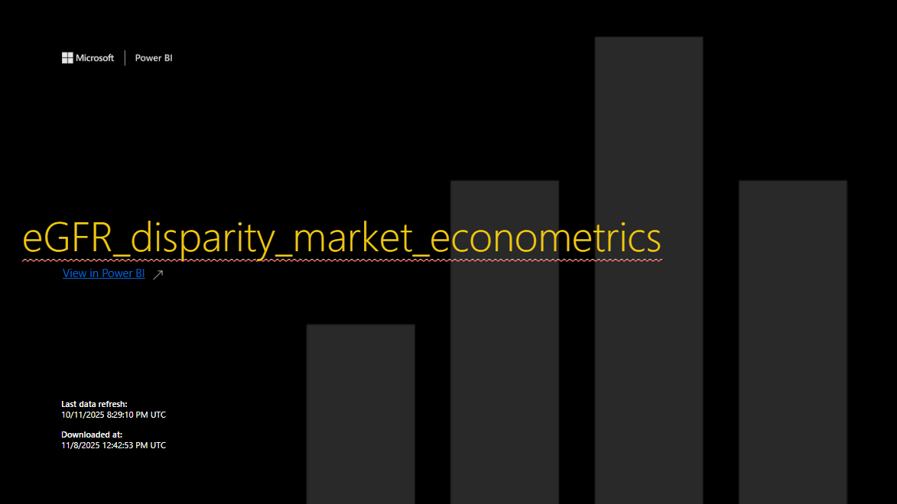
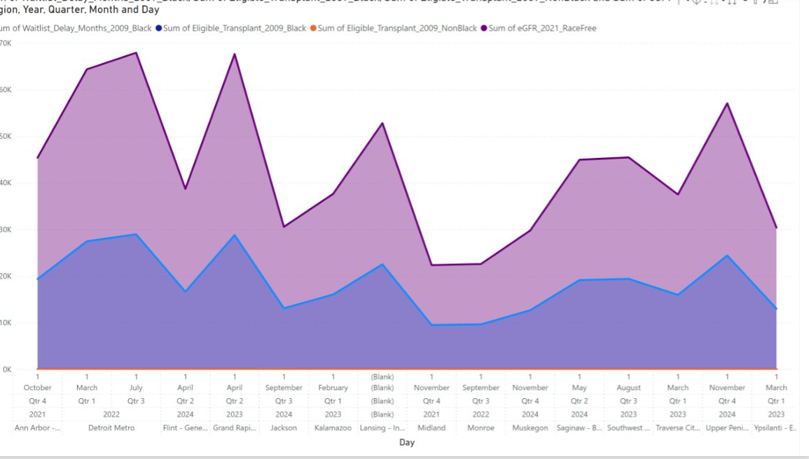
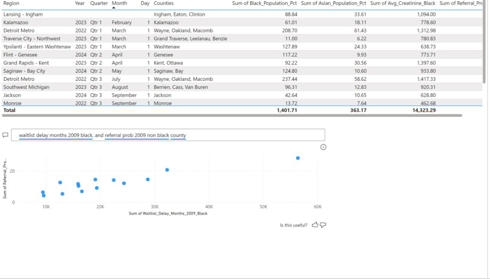

# Kidney Transplant Disparities Dashboard

## Problem
In this project, we propose an alternative algorithmic referral analytic that reimagines how health systems and policymakers assess equity in kidney transplantation access. By integrating econometric modeling with clinical data, we evaluate how race-based adjustments in the estimated Glomerular Filtration Rate (eGFR) equation create systemic delays in nephrology referral and transplant eligibility.

## Data sources
- UNOS 2009–2024
- State: Michigan
- Regions: Ann Arbor, Detroit Metro…

“Algorithmic Equity Simulation”

<math xmlns="http://www.w3.org/1998/Math/MathML" display="block"><semantics><mrow><mi>W</mi><mo>=</mo><munder><mo>∑</mo><mi>i</mi></munder><mo stretchy="false">[</mo><msub><mi>U</mi><mi>i</mi></msub><mo stretchy="false">(</mo><mtext>Access</mtext><mo stretchy="false">)</mo><mo>−</mo><msub><mi>τ</mi><mi>i</mi></msub><mo stretchy="false">(</mo><mtext>Bias</mtext><mo stretchy="false">)</mo><mo stretchy="false">]</mo></mrow><annotation encoding="application/x-tex">W = \sum_i [U_i(\text{Access}) - τ_i(\text{Bias})]</annotation></semantics></math>

## Metrics

- Waitlist Delay (Months)
- Eligible Transplant (2009)
- eGFR 2021 Race-Free
